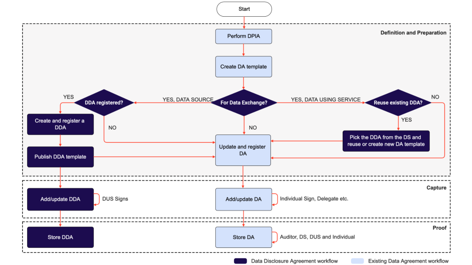
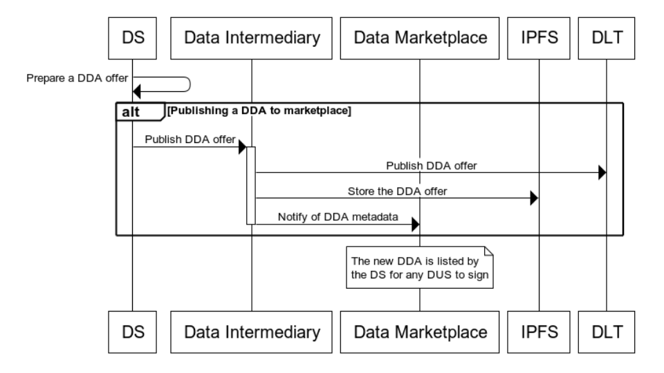
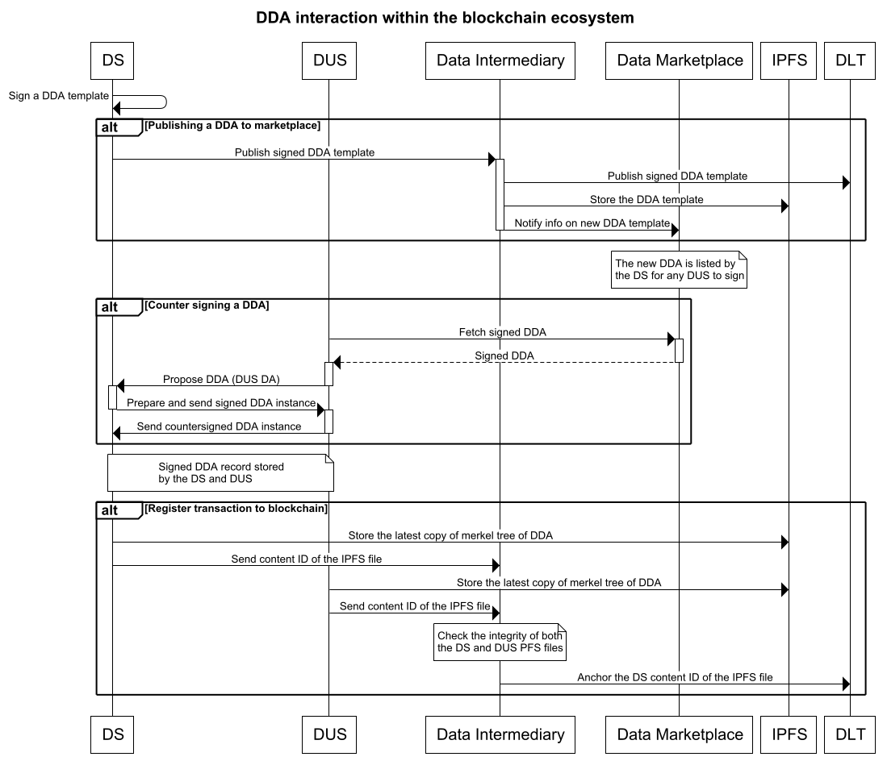
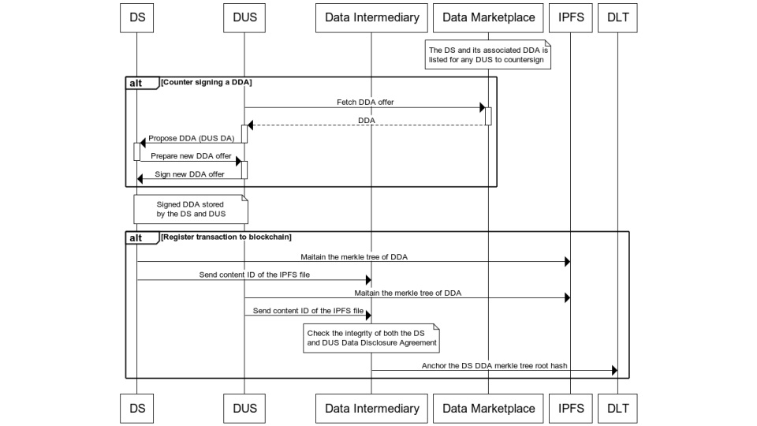

# Data Disclosure Agreement (DDA) Specification

**Specification Status:** version 1.0.0

This is reviewed and implementation has started. This spec is live and is being iterated as part of the PS-SDA project in NGI-ONTOCHAIN. The project has received funding from the European Union’s Horizon 2020 research and innovation programme under grant agreement No 957338.

**Latest Draft:** [Avaialble here](https://dda.igrant.io/protocol)

**Editors:**
- Mr. George Padayatti (iGrant.io, Sweden)  
- Mr. Jan Linquist (Linaltec, Sweden)  
- Mr. Lal Chandran (iGrant.io, Sweden)

**Contributors and Reviwers:**

- Dr. David Goodman (iGrant.io, Sweden)  
- Ms. Lotta Lundin (iGrant.io, Sweden) 

**Participate:**

- [GitHub repo](https://github.com/decentralised-dataexchange/data-exchange-agreements)
- [File a bug](https://github.com/decentralised-dataexchange/data-exchange-agreements/issues) 
- [Commit history](https://github.com/decentralised-dataexchange/data-exchange-agreements/commits/main)

------------------------------------
## Abstract

A Data Disclosure Agreement (DDA) enables automated agreement handling for data exchange between a Data Source (DS) and Data Using Service (DUS). It helps organisations to continue leveraging their data assets while being transparent and legitimate in their data usage. Automated agreement handling is a requisite for a scalable and regulatory-compliant data marketplace.. It also provides individuals control over how their data is used and exchanged.

## Introduction

Data is the ​critical currency of an advanced digital economy, and trust is fundamental for continuous access to personal data. An adequate governance framework is essential to build the requisite trust and must involve, at the very least, the following actors:

* **Individuals**, who can manage their preferences and follow their data,  should know who is consuming what, when and why.

* **Organisations**, which are either a DS or a DUS, should be able to leverage personal data and gain access to the right quality data, provided that: 

  * they offer adequate transparency for individuals to trust them. 
  * their data usage is compliant with the relevant data protection and privacy regulations which they can prove if requested.

* **Auditors**, who can independently prove fair data usage via independent audit mechanisms, can be used by organisations and individuals to ​verify the legitimacy of their claims in any legal dispute concerning the use or misuse of data. 

Any organisation undergoing digital transformation needs to ensure that it can cater to the above, so individuals continue to say “yes” to sharing their data. Initiatives like MyData Operator and the proposed EU Data Governance Act point to the need for data intermediaries ​to enable the above for individuals and businesses.

Data exchange agreements aim to enhance data governance to ​increase transparency and authenticity as ​critical elements for digital trust. This specification describes how the key actors above can capture, view or disclose the provenance trail of a personal data exchange transaction​,​ starting with ​creating data disclosure agreements during any such data exchanges. It also specifies how a DS can define rules for data processing (to demonstrate regulatory compliance etc.) in a data exchange transaction.

### Data intermediaries enabling data exchange

iGrant.io is a data exchange platform that helps organisations access personal data in a sustainable and human-centric manner. Using iGrant.io’s data exchange services, organisations gain access to verifiable, auditable and data regulatory compliant personal data. Every data exchange has an associated DA that records conditions for an organisation to process personal data in accordance with data regulations, such as the GDPR and the Data Governance Act, as illustrated in Figure 1 below.

*Figure 1. A data exchange ecosystem using a data intermediary*

### Data exchange agreement landscape

In a data exchange ecosystem, there are a number of agreements that are required to legally validate data exchanges. This chapter introduces various data exchange agreements (DEXA) and the relationships that exist between organisations and individuals, depending on their roles in different personal data usage scenarios. The various agreements involved can be classified into four broad categories as shown in Figure 2 below. These are agreements between:

1. An individual and an organisation, 
2. Two organisations (DS and DUS), 
3. An organisation and its supplier and 
4. Two individuals

*Figure 2. Data exchange agreement landscape*

#### Data Agreement (DA) or Personal Data Agreement

This is an agreement between an organisation and an individual when it comes to the use and processing of personal data. A data agreement can have any legal basis as outlined by the relevant data protection regulation. The agreement can be with a DS (issuer) or a DUS (verifier) and can also be used for personal data exchange with third parties.

Today, the DA is implemented via a W3C specified Decentralised Identifier (DID) DID:mydata. It records the conditions for an organisation to process personal data in accordance with data protection regulations. Regulations could be data laws or they could be norms such as the MyData principles. 

The key characteristics of a DA are as follows:

* It is associated with any personal data usage including data exchange 
* It has the ability to rely on an individual’s consent or other lawful basis such as contract, legal obligation, vital interests, public task and legitimate interests by outlining the purpose for which personal data is to be processed 
* It is tied to a data protection impact assessment (DPIA) that further strengthens legal compliance for the organisation. iGrant.io automates the conversion of the results of a DPIA to a machine-readable DA
* It is standardised via ISO/IEC JTC 1/SC 27 Information security, cybersecurity and privacy protection WG5: 27560 (working draft)

The key commercial values enabled by a DA are described below:

**Data regulatory compliance**: A DA based on a DPIA provides reassurance that the organisation has the intent to exchange data in compliance with a jurisdiction appropriate data protection regulation.

**Transparency**: A DA provides the requisite transparency to a data subject on how personal data is to be used by an organisation, especially if exchanged with third parties. 

**Auditability**: With a DA, a DS can prove its legitimate right to collect and share data with a DUS via digital token-based verification system. Similarly, an individual can dispute data usage for which no legitimacy can be proven using the signed DA.

#### Data Disclosure Agreement (DDA)

A Data Disclosure Agreement (DDA) exists between two organisations where one organisation acts as a DS and the other as a DUS. The DDA captures how data is shared between the two organisations and what role and obligation each party has, as either a data processor and/or a data controller. For any organisation involved in the data exchange, there is an associated DA that explains the purpose of processing personal data, what personal data is collected, what the data subject rights are, etc. Where both organisations are data controllers, the individual (data subject) has a signed DA with both.
#### Data Processing Agreement (DPA)
The third form of an agreement exists between an organisation and its suppliers, as illustrated in Figure 2. Here, there is a vertical relationship between Organisation A as a data controller and its supplier as a data processor or sub-processor. For a higher level of accountability between these organisations, a DPA is set up, which lays out what routines are required to be in place: for example, a data processor’s obligations in case of a data breach or how the rights of the individual, such as access rights, are supported, among other policies and routines. An auditor should also be able to inspect the organisation and use the DPA as reference material during the inspection. As depicted in Figure 2, the DPA  is connected  to the individual at the top of the hierarchy via the data controller organisation.

The concept of a DDA can be extended to include the DPA as well. This, however, is not within the scope of this project. For details on the DPA and its content please refer to Appendix C.

#### Delegation Agreement

The delegation agreement is included to complete the data exchange ecosystem. A delegate may act on behalf of an individual in signing off any data exchange. There are several scenarios where delegation is necessary for example in the case of guardianship when an individual is not capable of signing off or in case an individual is given temporary rights to sign off on behalf of the individual for example purchasing medicine at a pharmacy.

### Data provenance

W3C defines provenance as *the information about entities, activities, and agents  involved in producing a piece of data or thing, which can be used to form assessments about its quality, reliability or trustworthiness*. 

*Figure 3. Data provenance terminology*

There are different models that can be used to achieve data provenance. This includes the Open Provenance Model (OPM) and W3C PROV. Both these models have basic entity, activity and agent (people) components. The difference comes with W3C PROV providing additional terms to help with explaining the details of activity through the usage of “plans”. These plans set the details of the execution of an activity. 

In the context of a personal data exchange transaction, the agents are the actors involved in the personal data exchange transaction like the individuals (or data subjects) and organisations (DS and DUS), entities are the data being exchanged. The activities include create/read/update/delete (CRUD) operations on these agreements and will be further elaborated in this document. The model in Figure 3 is taken from the W3C PROV Primer to illustrate a high-level overview.

In a personal data transaction, provenance provides a critical foundation for assessing authenticity, enabling trust, and allowing reproducibility and the re-use of personal data. Once this is achieved, assertions could be made with regard to the use of contextual metadata (e.g. events in data agreements and data disclosure agreements) and can themselves become important records with their own provenance. Once provenance metadata is collected it is possible to check claims that are being made in the records.

## Regulations

### Legal requirements

GDPR and Data governance act
Data act and AI regulations

### Social norms and ethical practices

## Data Exchange Agreement overview

Figure 4 below illustrates a typical scenario where an organisation, Org. A, uses a DA to share data externally to Org B and Org C. Individual instances of the DA are signed by individuals X and Y. A DDA is used to govern the data exchange between Org A and Orgs B and C.

*Figure 4. Data exchange and provenance scenarios*

###	DEXA High-level workflow

As described in the background section, iGrant.io provides a decentralised data exchange service based on self-sovereign identity (SSI), OpenID Connect and OAuth protocols. The service enables organisations to exchange data in a transparent, secure and privacy-centric manner using verifiable data exchange agreements. The received data can be verified using SSI and X.509-based signatures. A DEXA workflow involves the following stages as illustrated in Figure 5:

*Figure 5. DA and DDA workflow*

These different phases are explained below: 

**Definition**: An existing agreement template is adopted as is or new ones are formulated in this phase. The template could be based on a particular industry and/or sector-specific practice. This can then be used by any organisation (DS or DUS) for a particular data usage purpose, in our case for enabling third party data exchange. 

**Preparation**: An organisation creates an agreement based on a DPIA or similar and shares it with relevant parties . For a DA, the relevant counterparty is the individual while for the DDA, it is a DUS. 

**Capture**: The counterparty signs the agreement in this phase. For a DDA, it is countersigned by the DUS while for a DA it’s the individual.

**Proof**: Any organisation or individual is able to demonstrate that an agreement exists between the parties. Independent auditors can also  check that  records  are in place proving that the individual's personal data may be processed (e.g. as per [GDPR Article 30](https://docs.igrant.io/regulations/reg-eu-gdpr#article-30-records-of-processing-activities)).

###	DEXA workflow enabling data provenance

The four phases described above are further elaborated in Figure 6 and explains how the DAs and DDAs are interlinked in the DEXA workflow. To ensure their compliance with data regulations, each organisation is encouraged to perform a privacy risk assessment or DPIA and ensure that risk mitigation measures are in place before collecting and processing personal data. 

*Figure 6: DA and DDA interlink within DEXA workflow*

When a DDA is signed and personal data has been exchanged, the DS is not liable for the DUS's use of personal data. However, the obligation to monitor the individual’s consent to share data with a third party, in this case, the DUS, remains with the DS. The DUS is obliged to adhere to the terms laid out in the DDA. If the DUS does not adhere to the DDA, the DS can, upon finding out about the infringement, withdraw the DDA and consequently revoke all the DAs associated with the DDA.

Throughout the DA lifecycle, cryptographic proofs are generated detailing who created the DA during the preparation phase and who signed it during the capture phase [2]. This is based on a W3C (DID:mydata) specification [4] and realised via a Data Agreement DIDComm protocol [5] implementation.

The key activities and actors involved in each phase are summarised in the table below:

<table>
  <tr>
   <td><strong>#</strong>
   </td>
   <td><strong>Activity</strong>
   </td>
   <td><strong>Phase</strong>
   </td>
   <td><strong>Actors</strong>
   </td>
  </tr>
  <tr>
   <td colspan="4" >Assessment
   </td>
  </tr>
  <tr>
   <td>1.0
   </td>
   <td>Perform DPIA or similar privacy assessment (external or self-assessment)

<em>Output: DA template consisting of usage purpose, data attribute etc as per the DA schema</em>
   </td>
   <td>Definition and preparation
   </td>
   <td>Assessor, DS, DUS
   </td>
  </tr>
  <tr>
   <td colspan="4" >For DS: Lawfully expose data and demonstrate provenance
   </td>
  </tr>
  <tr>
   <td>2.1
   </td>
   <td>If the organisation wishes to expose personal data to a third party, it creates the DDA template, If required, publishes to a data marketplace

<em>Output: DDA is available and is ready for any DUS to sign. </em>

<em>Provenance: action to create an entity (DDA) by an actor (DS).</em>
   </td>
   <td>Definition and preparation
   </td>
   <td>DS
   </td>
  </tr>
  <tr>
   <td>2.2
   </td>
   <td>Add DUS when they sign up

<em>Output: DDA is updated with the DUS signatory info (during the DDA capture phase)</em>

<em>Provenance: action to update and sign off entity (DDA) by an actor (DUS)</em>
   </td>
   <td>Capture
   </td>
   <td>DUS
   </td>
  </tr>
  <tr>
   <td>2.3
   </td>
   <td>Any interested party can check the signed DDA <em>proof of compliant data usage.</em>

<em>Provenance: Query to view provenance metadata</em>
   </td>
   <td>Proof
   </td>
   <td>Auditor, Individual, DS or DUS or any 3PP
   </td>
  </tr>
  <tr>
   <td>2.4
   </td>
   <td>Automated enforcement of DDA

<em>Provenance: query provenance metadata to ensure the signing of DDA is permitted</em>
   </td>
   <td>Proof,

Capture
   </td>
   <td>DS, DUS
   </td>
  </tr>
  <tr>
   <td colspan="4" >For DUS: Lawfully consume data and demonstrate provenance
   </td>
  </tr>
  <tr>
   <td>3.1
   </td>
   <td>If the organisation (DUS) wishes to consume data, it checks the available DDAs in the marketplace.
   </td>
   <td>Definition and Preparation
   </td>
   <td>DUS
   </td>
  </tr>
  <tr>
   <td>3.2
   </td>
   <td>Organisation (DUS) signs up (Same as step 2.2)
   </td>
   <td>Capture
   </td>
   <td>DUS
   </td>
  </tr>
  <tr>
   <td>3.3
   </td>
   <td>DUS updates and register the DA based on the DDA
   </td>
   <td>Definition and Preparation
   </td>
   <td>DUS
   </td>
  </tr>
  <tr>
   <td>3.4
   </td>
   <td>Any interested party can check the signed DA proof of compliant data usage
   </td>
   <td>Proof
   </td>
   <td>Auditor, Individual, DS or DUS or any 3PP
   </td>
  </tr>
</table>

#### Publish and Sign DDA sequence diagram

*Figure 7: DDA - Publish and sign sequence*

#### Data Provenance 

Appendix D in this specification provides a detailed ontology analysis of what needs to be captured in a provenance trail.  A DDA schema (Ref. chapter Ontologies) is proposed and the existing DA schema has been  updated to include the key elements required to establish data provenance when making the data available for third parties. By combining information from the DA and the DDA, a provenance trail can be generated to provide reassurance about the legitimacy of owning, trading or controlling copies of the data. With the usage of digital signatures, provenance trails are tamper-evident logs, which means you can cryptographically prove that data hasn’t been unexpectedly changed. A verifiable provenance trail helps in realising the accurate, immutable and verifiable history of activity and entity.

**Scenario 01:** Here DS and DUS do not need individual identity proof before the data exchange e.g. in the case of a DUS using  anonymous or pseudonymous data sharing to offer personalised services. 

Figure 8 elaborates on how the provenance is captured during a data exchange transaction in Scenario 01 where there is no need for identity proof (E.g. Anonymised data exchange). 

*Figure 8: Scenario 01: DA, DDA workflows without ID proof (E.g. anonymised data exchange)*

**Scenario 02:** DS and DUS require individual identity proof before the data exchange. This is the case, for e.g., during a registration process, check-ins, covid-credential exchange etc. This is illustrated in Figure 9.

*Figure 9. Scenario 02: DA, DDA workflows with ID proof*
### On-chain and off-chain agreements for provenance trail

A DDA can be realised as a smart contract adding the  key advantages of using a blockchain. The key considerations for the design of the PS-SDA blockchain-based solution are:

* **Authenticity** - Enabling verified agreements source and ownership
* **Scalability** - Can store large amounts of data at **low-cost**
* **Proof of membership** - Makes it easy to prove if a data disclosure agreement transaction occurred or not, e.g. signing, counter signing, data exchange without revealing PII data.
* **Tamper resistance** - Allows checking that data hasn’t been altered
* **Availability of transaction data** - Allows for immediate access to any transaction. The blockchain confirmation times [12] of mainstream blockchain are slow. E.g. the proof of work consensus mechanism in Bitcoin is 10 minutes while for Ethereum it is 2 minutes. 

During a DDA capture process, the signing transaction is registered on the chain to enable provenance. The solution will leverage features offered by ONTOCHAIN to develop and deploy a smart contract to facilitate seamless data exchanges between two organisations.
#### Publish to the marketplace via a DLT

During the creation of the data disclosure agreement, the DS creates a token of ownership for the DDA template and registers it to the blockchain. The DDA template is stored in the (Inter Planetary File System) IPFS. The signing process is facilitated  by a data intermediary service, such as iGrant.io, which acts as a notary and registers the signed DDA evidence (hash) to the blockchain.

*Figure 10. Publishing of DDAs by DS in the blockchain ecosystem*

The DS and the DUS do not need to understand the underlying witness system and cost mechanisms of using a DLT, e.g. Ethereum, bitcoin etc. The use of data intermediary service also reduces the costs associated with the footprint on the blockchain and solves the key issue of trust, e.g. who's signed DDA do you trust? 

The transaction data is on-chain as per chapter "Ontologies/ On-Chain Data", with the ownership of the DDA and event signature needed for data provenance. The DDA template is stored in the IPFS.

#### Countersigning of DDAs by the DUS via a DLT
Any DUS can view the DS and what data they are offering to share, countersign a DDA and use the data based on the terms set in the agreement as shown below.

*Figure 11. Countersigning of DDA by DUS in the blockchain ecosystem*

#### Off-chain and On-chain handling of data disclosure agreements

As illustrated in Figure 11 above, once the DDA is prepared, the signed DDA (by the DS) is broadcasted to the data intermediary. The data intermediary waits for the countersigned DDA from the DUS(s) and anchors it to the DLT. The detailed mechanism involved in anchoring (via a smart contract) to the underlying witness system (e.g. DLTs like blockchain, hash graphs) taking into account the key considerations (in chapter 3.2] is as pictured below Figure 12.

*Figure 12. Anchoring DDA transactions to a witness system, e.g. DLT*

The DDAs are always stored in local storage, a copy of which is available with the signing parties and the data intermediary. The hash of the DDA template (Hash (1)) forms the bottom leaf of the Merkle tree. Hash (2) represents the hash of the signed DDA when it is published to the data marketplace while Hash (3) represents the countersigned DDA. At a given point in time, the root hash from the Merkle tree is added to the DLT.
#### 3.3.4	Handling release of personal data

When the actual exchange of data happens from the DS to the DUS, an event and a corresponding proof is appended to the Data Disclosure Agreement. This provides for data exchange provenance to any interested parties. 
##	User stories and use case analysis
### 4.1	Individual
<table>
  <tr>
   <td><strong>Use case</strong>
   </td>
   <td><strong>Description</strong>
   </td>
  </tr>
  <tr>
   <td>View personal data flows 
   </td>
   <td>View the data provenance trail on what happens to personal data. This can be fetched from the DDA events with proof coming from the blockchain. 
   </td>
  </tr>
  <tr>
   <td>View shared organisations 
   </td>
   <td>View the DUS’ with which a DS has shared data. This can be fetched by from the DA and DDA with proof acquired via the blockchain
   </td>
  </tr>
  <tr>
   <td>View DDAs
   </td>
   <td>View the DDA template from the DS with the usage of personal data.
   </td>
  </tr>
  <tr>
   <td>View DAs 
   </td>
   <td>View the DAs in all organisations with whom the personal data has been shared.
   </td>
  </tr>
</table>
### Organisations (DS and DUS)

<table>
  <tr>
   <td><strong>Use case</strong>
   </td>
   <td><strong>Description</strong>
   </td>
  </tr>
  <tr>
   <td>CRUD DDAs
   </td>
   <td>The organisation administrator performs CRUD for DDAs.
   </td>
  </tr>
  <tr>
   <td>View personal data flows
   </td>
   <td>The organisation administrator can view the data provenance trial with proof of each data exchangetransaction. 
   </td>
  </tr>
  <tr>
   <td>Share proofs of DAs
   </td>
   <td>The organisation administrator can share the DA and DA record with an external party, e.g. a third-party auditor.
   </td>
  </tr>
  <tr>
   <td>Share proofs of DDAs
   </td>
   <td>The organisation administrator can share signed  DDA and DDA records (on and off chain) with an external party, e.g. a third-party auditor.
   </td>
  </tr>
  <tr>
   <td>Automated enforcement of DDAs 
   </td>
   <td>The organisation's (DUS) IT system can read the DDA and automatically enforce it before being able to process and use personal data.
   </td>
  </tr>
</table>

### Auditors
<table>
  <tr>
   <td><strong>Use case</strong>
   </td>
   <td><strong>Description</strong>
   </td>
  </tr>
  <tr>
   <td>View personal data flows 
   </td>
   <td>Received the complete data trail on what happens to personal data, with verifiable proof.
   </td>
  </tr>
  <tr>
   <td>View shared organisations 
   </td>
   <td>View the organisations with which the primary organisations have shared their data with proof
   </td>
  </tr>
  <tr>
   <td>View DDAs
   </td>
   <td>View the DDAs between organisations with verifiable proof
   </td>
  </tr>
</table>

## Detailed design specification
### Architecture diagram

The DEXA functions are available as microservices that can be plugged into existing systems, such as in iGrant.io SSI data exchange workflows. The core components are exposed as RESTFul APIs. The components can exist independently in any service provider agreement handling system. Here, the DA registry holds the signed DA records. In PS-SDA, we will add the DDA registry, as shown in Figure 13:

IMAGE
*Figure 13. DEXA microservice components*

In Figure 13, the agreement records can be both DA and DDA records. Together with the JSON-LD processing components, DA and DDA, all exposed as RESTFul APIs, form the core component in the DEXA architecture. The pluggable components could be replaced with any chosen implementation mechanisms.

### High-level software quality analysis

The project uses a DevOps process with established CI/CD practices. Quality assurance is via manual and automated tests by the development team. Validations are carried out by the product owners and signed off during each sprint. 

### APIs for SDKs

No SDKs are required for the DDA implementation. Existing DA SDKs will be reused and be revised to support new flows.
### Rest APIs for Services

The key interfaces are APIs classified under the key actors listed below. An early version of the DEXA APIs is published at the [iGrant.io swagger API hub](https://app.swaggerhub.com/apis-docs/iGrant.io/PS-SDA/1.0.0#/).

#### Individuals

<table>
  <tr>
   <td><strong>Action</strong>
   </td>
   <td><strong>Description</strong>
   </td>
  </tr>
  <tr>
   <td>GET /individuals/data-agreements
   </td>
   <td>View signed DAs
   </td>
  </tr>
  <tr>
   <td>GET /individuals/data-using-service
   </td>
   <td>View the shared data using services for a given organisation
   </td>
  </tr>
  <tr>
   <td>GET /individuals/data-disclosure-agreements
   </td>
   <td>View the DDA(s) in an organisation
   </td>
  </tr>
  <tr>
   <td>GET /individuals/data-agreements/{data_agreement_id}/provenance_trail
   </td>
   <td>Fetch provenance trail for a DA
   </td>
  </tr>
</table>

#### Organisations (DS and DUS)

<table>
  <tr>
   <td><strong>Action</strong>
   </td>
   <td><strong>Description</strong>
   </td>
  </tr>
  <tr>
   <td>POST /organisation/data-disclosure-agreement
   </td>
   <td>Create DDA template
   </td>
  </tr>
  <tr>
   <td>GET /organisation/data-disclosure-agreement
   </td>
   <td>List all published DDAs
   </td>
  </tr>
  <tr>
   <td>PUT /organisation/data-disclosure-agreement/{data_disclosure_agreement_id}
   </td>
   <td>Update signed DDA by ID
   </td>
  </tr>
  <tr>
   <td>DELETE /organisation/data-disclosure-agreement/{data_disclosure_agreement_id}
   </td>
   <td>Delete signed DDA by ID
   </td>
  </tr>
  <tr>
   <td>GET /organisation/data-agreements
   </td>
   <td>View signed DAs (Org. copy)
   </td>
  </tr>
  <tr>
   <td>GET /organisation/data-agreements/{data_agreement_id}/provenance_trail
   </td>
   <td>Fetch provenance trail for a DA
   </td>
  </tr>
  <tr>
   <td>POST /organisation/data-disclosure-agreements/{data_disclosure_agreement_id}/organisation/{organisation_id}/offer
   </td>
   <td>Offer a DDA to an organisation
   </td>
  </tr>
  <tr>
   <td>POST /organisation/data-disclosure-agreements/{data_disclosure_agreement_instance_id}/accept
   </td>
   <td>Accept a DDA sent by an organisation
   </td>
  </tr>
  <tr>
   <td>POST /organisation/data-disclosure-agreements/{data_disclosure_agreement_instance_id}/reject
   </td>
   <td>Reject a DDA sent by an organisation
   </td>
  </tr>
  <tr>
   <td>POST /organisation/data-disclosure-agreements/{data_disclosure_agreement_instance_id}/terminate
   </td>
   <td>Terminate a DDA sent by an organisation
   </td>
  </tr>
  <tr>
   <td>POST /organisation/data-agreements/{data_agreement_id}/auditor/{auditor_id}/request-verify
   </td>
   <td>Request verification of a DA instance by a third party auditor
   </td>
  </tr>
  <tr>
   <td>POST /organisation/audit-requests
   </td>
   <td>Query audit requests sent
   </td>
  </tr>
</table>

#### Auditors

<table>
  <tr>
   <td><strong>Action</strong>
   </td>
   <td><strong>Description</strong>
   </td>
  </tr>
  <tr>
   <td>POST /organisation/audit-requests
   </td>
   <td>Query audit requests received
   </td>
  </tr>
  <tr>
   <td>POST /auditor/audit-requests/{audit_request_id}/verify
   </td>
   <td>Verify the digital signatures in DA
   </td>
  </tr>
</table>

### Ontologies
#### Data Disclosure Agreement

<table>
  <tr>
   <td><strong>Attribute Name</strong>
   </td>
   <td><strong>Mandatory</strong>
   </td>
   <td><strong>Description</strong>
   </td>
  </tr>
  <tr>
   <td><code>@context</code>
   </td>
   <td>TRUE
   </td>
   <td>Defines the context of this document. E.g. the link the JSON-LD
   </td>
  </tr>
  <tr>
   <td><code>id</code>
   </td>
   <td>TRUE
   </td>
   <td>Identifier to the data disclosure agreement instance addressed to a specific DUS
   </td>
  </tr>
  <tr>
   <td><code>version</code>
   </td>
   <td>TRUE
   </td>
   <td>Version number of the data disclosure agreement
   </td>
  </tr>
  <tr>
   <td><code>template_id</code>
   </td>
   <td>TRUE
   </td>
   <td>Identifier to the template of the data disclosure agreement
   </td>
  </tr>
  <tr>
   <td><code>template_version</code>
   </td>
   <td>TRUE
   </td>
   <td>Version number of the data disclosure agreement template
   </td>
  </tr>
  <tr>
   <td><code>language</code>
   </td>
   <td>TRUE
   </td>
   <td>language used. If not present default language is English
   </td>
  </tr>
  <tr>
   <td><code>data_controller</code>
   </td>
   <td>TRUE
   </td>
   <td>Encapsulates the data controller data
   </td>
  </tr>
  <tr>
   <td><code> - did</code>
   </td>
   <td>TRUE
   </td>
   <td>This is the DID of the data source preparing the agreement
   </td>
  </tr>
  <tr>
   <td><code> - name</code>
   </td>
   <td>TRUE
   </td>
   <td>The name of the data source exposing the data
   </td>
  </tr>
  <tr>
   <td><code> - legal_id</code>
   </td>
   <td>TRUE
   </td>
   <td>This is the legal ID to the data source. E.g. Swedish Organisation Number
   </td>
  </tr>
  <tr>
   <td><code> - url</code>
   </td>
   <td>TRUE
   </td>
   <td>This is the data source organisation URL
   </td>
  </tr>
  <tr>
   <td><code> - industry_sector</code>
   </td>
   <td>TRUE
   </td>
   <td>Industry sector that the DS belongs to
   </td>
  </tr>
  <tr>
   <td><code>agreement_period</code>
   </td>
   <td>TRUE
   </td>
   <td>Duration of the agreement after which the data disclosure agreement expires
   </td>
  </tr>
  <tr>
   <td><code>data_sharing_restrictions</code>
   </td>
   <td>TRUE
   </td>
   <td>Used by the DS to configure any data sharing restrictions towards the DUS. This could reuse the data agreement policy parameters as is.
   </td>
  </tr>
  <tr>
   <td><code> - policy_URL</code>
   </td>
   <td>TRUE
   </td>
   <td>URL to the privacy policy document of the DS
   </td>
  </tr>
  <tr>
   <td><code> - jurisdiction</code>
   </td>
   <td>TRUE
   </td>
   <td>The jurisdiction associated with the data source exposing the personal data that the privacy regulation is followed. These can be country, economic union, law, location or region. [value based on<a href="https://w3c.github.io/dpv/dpv/#vocab-jurisdictions"> W3C Location and Jurisdiction</a>]
   </td>
  </tr>
  <tr>
   <td><code> - industry_sector</code>
   </td>
   <td>FALSE
   </td>
   <td>The sector to which the data source restricts the use of data by any data using services. If no restriction, leave blank
   </td>
  </tr>
  <tr>
   <td><code> - data_retention_period</code>
   </td>
   <td>TRUE
   </td>
   <td>The amount of time that the data source holds onto any personal data, in days.
   </td>
  </tr>
  <tr>
   <td><code> - geographic_restriction</code>
   </td>
   <td>FALSE
   </td>
   <td>The country or economic union is restricted from processing personal data.[value based on<a href="https://w3c.github.io/dpv/dpv/#vocab-jurisdictions"> W3C Location and Jurisdiction</a>] for the data source
   </td>
  </tr>
  <tr>
   <td><code> - storage_location</code>
   </td>
   <td>FALSE
   </td>
   <td>The geographic location where the personal data is stored by the data source
   </td>
  </tr>
  <tr>
   <td><code>purpose</code>
   </td>
   <td>TRUE
   </td>
   <td>Describes the purpose for which the data source shares personal data as described in the data agreement [values based on W3C DPV Purposes]
   </td>
  </tr>
  <tr>
   <td><code>purpose_description</code>
   </td>
   <td>TRUE
   </td>
   <td>Additional description of the purpose for which the data source shares personal data
   </td>
  </tr>
  <tr>
   <td><code>lawful_basis</code>
   </td>
   <td>TRUE
   </td>
   <td>Indicate the lawful basis for sharing personal data. These can be consent, legal obligation, contract, vital interest, public task or legitimate_interest. [values based on<a href="https://w3c.github.io/dpv/dpv/#legal_basis-classes"> W3C DPV legal basis</a>]
   </td>
  </tr>
  <tr>
   <td><code>personal_data []</code>
   </td>
   <td>TRUE
   </td>
   <td>Encapsulates the attributes shared by the data source
   </td>
  </tr>
  <tr>
   <td><code> - attribute_id</code>
   </td>
   <td>TRUE
   </td>
   <td>Identity of the attribute that is being shared
   </td>
  </tr>
  <tr>
   <td><code> - attribute_name</code>
   </td>
   <td>TRUE
   </td>
   <td>Name of the attributes that is being shared
   </td>
  </tr>
  <tr>
   <td><code> - attribute_sensitive</code>
   </td>
   <td>FALSE
   </td>
   <td>Defines the sensitivity of the data as per PII
   </td>
  </tr>
  <tr>
   <td><code> - attribute_category</code>
   </td>
   <td>FALSE
   </td>
   <td>An explicit list of personal data categories to be shared. The categories shall be defined using language meaningful to the users and consistent with the purposes of the processing. [values based on<a href="https://w3c.github.io/dpv/dpv-pd/"> W3C DPV-DP</a>]
   </td>
  </tr>
  <tr>
   <td><code>code_of_conduct</code>
   </td>
   <td>FALSE
   </td>
   <td>The code of conduct is followed by the data source. This provides the proper application of privacy regulation taking into account specific features within a sector. The code of conduct shall reference the name of the code of conduct and with a publicly accessible reference.
   </td>
  </tr>
  <tr>
   <td><code>data_using_service</code>
   </td>
   <td>TRUE
   </td>
   <td>The data using services that have signed up for consuming data. This get populated after the data disclosure agreement is proposed by the data using service
   </td>
  </tr>
  <tr>
   <td><strong><code> - did</code></strong>
   </td>
   <td>TRUE
   </td>
   <td>This is the DID of the data using service signing the agreement
   </td>
  </tr>
  <tr>
   <td><code> - name</code>
   </td>
   <td>TRUE
   </td>
   <td>Name of the DUS signing the agreement
   </td>
  </tr>
  <tr>
   <td><code> - legal_id</code>
   </td>
   <td>TRUE
   </td>
   <td>The legal ID of the data using service
   </td>
  </tr>
  <tr>
   <td><code> - url</code>
   </td>
   <td>TRUE
   </td>
   <td>This is the data using service organisation URL
   </td>
  </tr>
  <tr>
   <td><code> - industry_sector</code>
   </td>
   <td>TRUE
   </td>
   <td>Industry sector that the DUS belongs to
   </td>
  </tr>
  <tr>
   <td><code> - usage_purposes</code>
   </td>
   <td>TRUE
   </td>
   <td>The purpose for which the data is being used by the DUS
   </td>
  </tr>
  <tr>
   <td><code> - jurisdiction</code>
   </td>
   <td>TRUE
   </td>
   <td>The jurisdiction associated with the data using service consuming personal data that the privacy regulation is followed. These can be country, economic union, law, location or region. [value based on W3C Location and Jurisdiction]
   </td>
  </tr>
  <tr>
   <td><code> - withdrawal</code>
   </td>
   <td>FALSE
   </td>
   <td>Reference to how data subject may withdraw.
   </td>
  </tr>
  <tr>
   <td><code> - privacy rights</code>
   </td>
   <td>FALSE
   </td>
   <td>Reference to information on how to exercise privacy rights (ex. erasure, objection, withdrawal, copy)
   </td>
  </tr>
  <tr>
   <td><code> - signature_contact</code>
   </td>
   <td>FALSE
   </td>
   <td>The responsible entity or person in the organisation signing the data disclosure agreement
   </td>
  </tr>
  <tr>
   <td><code>event []</code>
   </td>
   <td>TRUE
   </td>
   <td>Encapsulates the data disclosure agreement lifecycle event data. For e.g. data disclosure agreement Offer, Accept, Reject, Terminate etc.
   </td>
  </tr>
  <tr>
   <td><code> - id</code>
   </td>
   <td>TRUE
   </td>
   <td>Event identifier
   </td>
  </tr>
  <tr>
   <td><code> - time-stamp</code>
   </td>
   <td>TRUE
   </td>
   <td>Event timestamp (ISO 8601 UTC)
   </td>
  </tr>
  <tr>
   <td><strong><code> - did</code></strong>
   </td>
   <td>TRUE
   </td>
   <td>Should match the data_using_service did
   </td>
  </tr>
  <tr>
   <td><code> - state</code>
   </td>
   <td>TRUE
   </td>
   <td>The various available states are: offer/accept/reject/terminate/fetch-data
   </td>
  </tr>
  <tr>
   <td><code>proof []</code>
   </td>
   <td>TRUE
   </td>
   <td>
   </td>
  </tr>
  <tr>
   <td><code> - id</code>
   </td>
   <td>TRUE
   </td>
   <td>Proof identifier
   </td>
  </tr>
  <tr>
   <td><code> - type</code>
   </td>
   <td>TRUE
   </td>
   <td>Signature schema type (For e.g. ed25519, es256 e.t.c.)
   </td>
  </tr>
  <tr>
   <td><code> - created</code>
   </td>
   <td>TRUE
   </td>
   <td>Proof creation time (ISO 8601 UTC)
   </td>
  </tr>
  <tr>
   <td><strong><code> - verificationMethod</code></strong>
   </td>
   <td>TRUE
   </td>
   <td>Should match the data_using_service did
   </td>
  </tr>
  <tr>
   <td><code> - proofPurpose</code>
   </td>
   <td>TRUE
   </td>
   <td>Contract agreement (Type inferred from JSON-LD spec)
   </td>
  </tr>
  <tr>
   <td><code> - proofValue</code>
   </td>
   <td>TRUE
   </td>
   <td>Proof value
   </td>
  </tr>
</table>

#### Data Agreement

The existing DA schema ([v1](https://docs.igrant.io/docs/data-agreements/v1)) is updated to include the following:

* The events with additional states to take care of third party data exchange handling
* DA revocation list
* DA expiry date to refetch the data based on the rules set by the DS

<table>
  <tr>
   <td>
<strong>Attribute Name</strong>
   </td>
   <td><strong>Description</strong>
   </td>
  </tr>
  <tr>
   <td><code>@context</code>
   </td>
   <td>Defines the context of any this document. E.g. the link the JSON-LD
   </td>
  </tr>
  <tr>
   <td><code>id</code>
   </td>
   <td>Identifier to the data agreement instance addressed to a specific individual (Data Subject)
   </td>
  </tr>
  <tr>
   <td><code>version</code>
   </td>
   <td>Version number of the data agreement
   </td>
  </tr>
  <tr>
   <td><code>template_id</code>
   </td>
   <td>Identifier to the template of the data agreement
   </td>
  </tr>
  <tr>
   <td><code>template_version</code>
   </td>
   <td>Version number of the data agreement template
   </td>
  </tr>
  <tr>
   <td><code>language</code>
   </td>
   <td>Is the language used. If not present default language is English
   </td>
  </tr>
  <tr>
   <td><code>data_controller_name</code>
   </td>
   <td>The name of the data controller processing the data
   </td>
  </tr>
  <tr>
   <td><code>data_controller_url</code>
   </td>
   <td>This is the controller URL
   </td>
  </tr>
  <tr>
   <td><code>data_controller_legal_id</code>
   </td>
   <td>This is the legal ID to the data controller. E.g. Swedish org. number
   </td>
  </tr>
  <tr>
   <td><code>data_policy</code>
   </td>
   <td>Encapsulates the data policies used in the use of personal data
   </td>
  </tr>
  <tr>
   <td><code> - policy_URL</code>
   </td>
   <td>URL to the privacy policy document of the data controller organisation
   </td>
  </tr>
  <tr>
   <td><code> - jurisdiction</code>
   </td>
   <td><a href="https://w3c.github.io/dpv/dpv/#vocab-jurisdictions">The jurisdiction associated with the organisation processing personal data that the privacy regulation is followed. This can be a country, economic union, law, location or region. [value based on W3C Location and Jurisdiction</a>]
   </td>
  </tr>
  <tr>
   <td><code> - industry_sector</code>
   </td>
   <td>The sector to which the data controller belongs to
   </td>
  </tr>
  <tr>
   <td><code> - data_retention_period</code>
   </td>
   <td>The amount of time that an organization holds onto any personal data, in days (per purpose)
   </td>
  </tr>
  <tr>
   <td><code> - geographic_restriction</code>
   </td>
   <td>The country or economic union is restricted for processing personal data [value based on <a href="https://w3c.github.io/dpv/dpv/#vocab-jurisdictions">W3C Location and Jurisdiction</a>]
   </td>
  </tr>
  <tr>
   <td><code> - storage_location</code>
   </td>
   <td>The geographic location where the personal data is stored
   </td>
  </tr>
  <tr>
   <td><code> - third_party_disclosure</code>
   </td>
   <td>This is a boolean value to indicate that the DA is used for third party data disclosures. This indicates that some data disclosures will happen and is used to release personal data to DUS based on an agreement
   </td>
  </tr>
  <tr>
   <td><code>purpose</code>
   </td>
   <td>Describes the purpose for which a data controller (DSor DUS) uses personal data. This is the purpose for which the data agreement is being formulated.[values based on W3C DPV Purposes]
   </td>
  </tr>
  <tr>
   <td><code>purpose_description</code>
   </td>
   <td>Provides a description of the purpose for which the personal data is used 
   </td>
  </tr>
  <tr>
   <td><code>lawful_basis</code>
   </td>
   <td>Indicates the lawful basis for processing personal information. This can be based on consent, legal obligation, contract, vital interest, public task or legitimate_interest. [values based on W3C DPV legal basis]
   </td>
  </tr>
  <tr>
   <td><code>method_of_use</code>
   </td>
   <td>Type of processing of personal data [value based on<a href="https://w3c.github.io/dpv/dpv/#vocab-processing"> W3C DPV Processing</a>]
   </td>
  </tr>
  <tr>
   <td><code>personal_data []</code>
   </td>
   <td>Encapsulates the attributes used for the usage purpose defined
   </td>
  </tr>
  <tr>
   <td><code> - attribute_id</code>
   </td>
   <td>Identity of the attribute that is being processed
   </td>
  </tr>
  <tr>
   <td><code> - attribute_name</code>
   </td>
   <td>Name of the attributes that is being processed
   </td>
  </tr>
  <tr>
   <td><code> - attribute_sensitive</code>
   </td>
   <td>[OPTIONAL] Defines the sensitivity of the data as per PII (Personal Identifiable Information)
   </td>
  </tr>
  <tr>
   <td><code> - attribute_category</code>
   </td>
   <td>An explicit list of personal data categories to be processed for the specified purpose. The categories shall be defined using language meaningful to the users and consistent with the purposes of processing. [values based on <a href="https://w3c.github.io/dpv/dpv-pd/">W3C DPV-DP</a>]
   </td>
  </tr>
  <tr>
   <td><code> - restrictions []</code>
   </td>
   <td>[OPTIONAL] If provided, this can be used to restrict where the data is being consumed
   </td>
  </tr>
  <tr>
   <td><code>  -- schema_ID</code>
   </td>
   <td>[OPTIONAL] Restrict data from this personal data schema issued by a legal entity
   </td>
  </tr>
  <tr>
   <td><code> -- credential_def_ID</code>
   </td>
   <td>[OPTIONAL] Restrict data from this credential schema from an organisation
   </td>
  </tr>
  <tr>
   <td><code>dpia</code>
   </td>
   <td>Encapsulate the organisation performing the Data Protection Impact Assessment (DPIA)
   </td>
  </tr>
  <tr>
   <td><code> - dpia_date</code>
   </td>
   <td>The data when the latest DPIA was carried out
   </td>
  </tr>
  <tr>
   <td><code> - dpia_summary_url</code>
   </td>
   <td>The URL to the DPIA summary information
   </td>
  </tr>
  <tr>
   <td><code>code_of_conduct</code>
   </td>
   <td>The data controller may follow a code of conduct which sets the proper application of privacy regulation taking into account specific features within a sector. The code of conduct shall reference the name of the code of conduct and with a public accessible reference.
   </td>
  </tr>
  <tr>
   <td><code>event []</code>
   </td>
   <td>Encapsulates the data agreement lifecyle event data. For e.g. Data Agreement Offer, Accept, Reject, Terminate etc.
   </td>
  </tr>
  <tr>
   <td><code> - id</code>
   </td>
   <td>Event identifier
   </td>
  </tr>
  <tr>
   <td><code> - time-stamp</code>
   </td>
   <td>Event timestamp (ISO 8601 UTC)
   </td>
  </tr>
  <tr>
   <td><code> - did</code>
   </td>
   <td>The DID associated with the entity executing the event. E.g. An organisation (Data Controller) or an Individual (Data Subject)
   </td>
  </tr>
  <tr>
   <td><code> - state</code>
   </td>
   <td>The current state of the event during a data agreement lifecycle. E.g. Offer, Accept, Reject and Terminate
   </td>
  </tr>
  <tr>
   <td><code>proof []</code>
   </td>
   <td>Encapsulates the event signatures that allows anyone (e.g. an auditor) to verify the authenticity and source of the data agreement. It uses linked data proofs as per W3C and contains a set of attributes that represent a Linked Data digital proof and the parameters required to verify it
   </td>
  </tr>
  <tr>
   <td><code> - id</code>
   </td>
   <td>Proof identifier
   </td>
  </tr>
  <tr>
   <td><code> - type</code>
   </td>
   <td>Signature schema type (For e.g. ed25519, es256 e.t.c.)
   </td>
  </tr>
  <tr>
   <td><code> - created</code>
   </td>
   <td>Creation time of the proof (ISO 8601 UTC)
   </td>
  </tr>
  <tr>
   <td><code> - verificationMethod</code>
   </td>
   <td>Should match the data_using_service did
   </td>
  </tr>
  <tr>
   <td><code> - proofPurpose</code>
   </td>
   <td>Purpose of the proof
   </td>
  </tr>
  <tr>
   <td><code> - proofValue</code>
   </td>
   <td>Proof value
   </td>
  </tr>
  <tr>
   <td><code>data_subject_did</code>
   </td>
   <td>The DID of the data subject signing the agreement
   </td>
  </tr>
  <tr>
   <td><code>revocation_list</code>
   </td>
   <td>Link to the storage location of the revocation list for the agreement
   </td>
  </tr>
  <tr>
   <td><code>data_expiry</code>
   </td>
   <td>Expiry for the agreement (in epoch time)
   </td>
  </tr>
</table>

#### On-Chain Data

Only the DS/DUS DIDs and the root hash value based on the Merkle tree of the DDA/DA is stored on chain.
## Interoperability

*Work in progress*

## Appendix A: References

[1] 	[Automated Data Agreements](https://github.com/decentralised-dataexchange/automated-data-agreements) (Linaltec, iGrant.io and PrivacyAnt with NGI eSSIF-Lab)

[2]  Lundin, L and Chandran, L, Lindquist, J: [Data Agreement Specification](https://github.com/decentralised-dataexchange/automated-data-agreements/blob/main/docs/data-agreement-specification.md )

[3]	Lindquist, J: (ISO Standards editor) Information technologies — Consent record information structure, ISO/IEC 27560 (working draft)

[4]	Data Agreement DID Method Specification, Available at: [https://github.com/decentralised-dataexchange/automated-data-agreements/blob/main/docs/did-spec.md](https://github.com/decentralised-dataexchange/automated-data-agreements/blob/main/docs/did-spec.md)  [Accessed: 13-Jan-2022]

[5]	Data Agreement - DIDComm Protocol Specification, Available at:[https://github.com/decentralised-dataexchange/automated-data-agreements/blob/main/docs/didcomm-protocol-spec.md](https://github.com/decentralised-dataexchange/automated-data-agreements/blob/main/docs/didcomm-protocol-spec.md) [Accessed: 13-Jan-2022]

[6]	iGrant.io Data Wallet: [https://igrant.io/datawallet.html](https://igrant.io/datawallet.html) [Accessed: 13-Jan-2022]

[7]	The Open Provenance Model core specification (v1.1), Available: [https://www.sciencedirect.com/science/article/abs/pii/S0167739X10001275](https://www.sciencedirect.com/science/article/abs/pii/S0167739X10001275) [Accessed: 13-Jan-2022]

[8]	W3C PROV-Data Model: [https://www.w3.org/TR/2013/REC-prov-dm-20130430/](https://www.w3.org/TR/2013/REC-prov-dm-20130430/) [Accessed: 23-Feb-2022]

[9] 	W3C PROV-O: The PROV Ontology, Available at: [https://www.w3.org/TR/prov-o/](https://www.w3.org/TR/prov-o/) [Accessed: 23-Feb-2022]

[10] W3C PROV Model Primer, Available at:[https://www.w3.org/TR/prov-primer/](https://www.w3.org/TR/prov-primer/) [Accessed: 23-Feb-2022]

[11] The OPM Provenance Model (OPM), Available at: [https://openprovenance.org/opm/](https://openprovenance.org/opm/) [Accessed: 23-Feb-2022]

[12]	Ethereum whitepaper: [https://ethereum.org/en/whitepaper/](https://ethereum.org/en/whitepaper/) [Accessed: 01 April 2022]

## Appendix B: Glossary
### B.1	Abbreviations

<table>
  <tr>
   <td><strong>Abbr.</strong>
   </td>
   <td><strong>Description</strong>
   </td>
  </tr>
  <tr>
   <td>ADA
   </td>
   <td>Automated Data Agreements
   </td>
  </tr>
  <tr>
   <td>CRUD
   </td>
   <td>Create / Read / Update / Delete
   </td>
  </tr>
  <tr>
   <td>DA
   </td>
   <td>Data Agreement 
   </td>
  </tr>
  <tr>
   <td>DAO
   </td>
   <td>Decentralized Autonomous Organizations
   </td>
  </tr>
  <tr>
   <td>DDA
   </td>
   <td>Data Disclosure Agreement (Introduced first in this specification)
   </td>
  </tr>
  <tr>
   <td>DEXA
   </td>
   <td>Data Exchange Agreements
   </td>
  </tr>
  <tr>
   <td>DID
   </td>
   <td>Decentralised Identifier (according to W3C)
   </td>
  </tr>
  <tr>
   <td>DPA
   </td>
   <td>Data Processing Agreement
   </td>
  </tr>
  <tr>
   <td>DPIA
   </td>
   <td>Data Protection Impact Assessment
   </td>
  </tr>
  <tr>
   <td>DS
   </td>
   <td>Data Source
   </td>
  </tr>
  <tr>
   <td>DUS
   </td>
   <td>Data Using Service
   </td>
  </tr>
  <tr>
   <td>EEA
   </td>
   <td>European Economic Area
   </td>
  </tr>
  <tr>
   <td>EU
   </td>
   <td>European Union
   </td>
  </tr>
  <tr>
   <td>GDPR
   </td>
   <td>General Data Protection Regulation
   </td>
  </tr>
  <tr>
   <td>IPFS
   </td>
   <td>Inter Planetary File System
   </td>
  </tr>
  <tr>
   <td>ISO
   </td>
   <td>International Organization for Standardization
   </td>
  </tr>
  <tr>
   <td>JSON
   </td>
   <td>JavaScript Object Notation
   </td>
  </tr>
  <tr>
   <td>SDK
   </td>
   <td>Software Development Kit
   </td>
  </tr>
  <tr>
   <td>SSI
   </td>
   <td>Self Sovereign Identity
   </td>
  </tr>
  <tr>
   <td>ToIP
   </td>
   <td>Trust over Internet Protocol
   </td>
  </tr>
  <tr>
   <td>VC
   </td>
   <td>Verifiable credentials
   </td>
  </tr>
  <tr>
   <td>W3C
   </td>
   <td>World wide web consortium
   </td>
  </tr>
</table>

### B.2	Terminology
<table>
  <tr>
   <td><strong>Term</strong>
   </td>
   <td><strong>Description</strong>
   </td>
  </tr>
  <tr>
   <td>Data Agreement (DA)
   </td>
   <td>A data agreement exists between organisations and individuals in the use of personal data. This agreement can have any legal basis outlined according to any data protection regulation, such as the GDPR.
   </td>
  </tr>
  <tr>
   <td>Data Disclosure Agreement (DDA)
   </td>
   <td>Data disclosure agreements are formal contracts that detail what data is being shared and the appropriate use for the data between a DS and a DUS. It records conditions on which a DUS will consume data from a DS. A DDA could contain both personal and non-personal data.
   </td>
  </tr>
  <tr>
   <td>Decentralised IDentifier (DID)
   </td>
   <td>A DID is a new type of identifier that is globally unique, resolvable with high availability, and cryptographically verifiable. DIDs are typically associated with cryptographic material, such as public keys and service endpoints, for establishing secure communication channels.
   </td>
  </tr>
  <tr>
   <td>Data Processing Agreement
   </td>
   <td>A Data Processing Agreement is a legally binding contract, either in written or electronic form, entered between a data processor and a data controller that states the rights and obligations of each party concerning the protection of personal data. The agreement will be legally binding in any data protection regulation, such as the GDPR.
   </td>
  </tr>
  <tr>
   <td>Data Source (DS)
   </td>
   <td>The role responsible for collecting, storing, and controlling personal data that persons, operators, and data using services may wish to access and use; defined as per MyData.
   </td>
  </tr>
  <tr>
   <td>Data Using Service (DUS)
   </td>
   <td>The role responsible for processing personal data from one or more data sources to deliver a service; is defined as per MyData
   </td>
  </tr>
  <tr>
   <td>Data Protection Impact Assessment (DPIA).
   </td>
   <td>A Data Protection Impact Assessment is a process designed to help systematically analyse, identify and minimise the data protection risks of a project or plan.
   </td>
  </tr>
  <tr>
   <td>Individual
   </td>
   <td>A natural, living human being, in the GDPR also referred to as a data subject
   </td>
  </tr>
  <tr>
   <td>Self Sovereign Identity
   </td>
   <td>A model for managing digital identities where individual identity holders can create and control their verifiable credentials without being forced to request permission from an intermediary or centralised authority and give control over how their data is shared and used
   </td>
  </tr>
</table>

## Appendix C: Data Processing Agreement (DPA)

Processing personal data on behalf of another organisation requires a Data Processing Agreement (DPA). The one processing personal data is a data Processor, and the one using the services of the data processor is the data controller. The DPA is required to ensure that when something goes wrong, there are steps to address, for example, a security incident. Guidance for creating a “Data Processing Agreement” is based on GDPR Article 28 and can be summarised in the following list:  

* Processing only on the controller’s documented instructions (Article 28(3)(a)) 
* Duty of confidence (Article 28(3)(b)) 
* Appropriate security measures (Article 28(3)(c)) 
* Using sub-processors (Article 28(3)(d)) 
* Data subjects’ rights (Article 28(3)(e)) 
* Assisting the controller (Article 28(3)(f)) 
* End-of-contract provisions (Article 28(3)(g)) 
* Audits and inspections (Article 28(3)(h)) 

Below is a [DPA template](https://edpb.europa.eu/sites/edpb/files/files/file2/dk_sa_standard_contractual_clauses_january_2020_en.pdf) from the Danish Data Protection Agency (Datatilsynet) which is endorsed by the  EDPB. These sections are the relevant ones to this analysis.

1. Table of Contents \
2. Preamble \
3. The rights and obligations of the data controller \
4. The data processor acts according to instructions \
5. Confidentiality \
6. Security of processing \
7. Use of sub-processors \
8. Transfer of data to third countries or international organisations \
9. Assistance to the data controller	 \
10. Notification of personal data breach \
11. Erasure and return of data \
12. Audit and inspection \
13. The parties’ agreement on other terms \
14. Commencement and termination \
15. Data controller and data processor contacts/contact points \

Included in the template are three appendixes that need to be filled out.

Appendix, A Information about the processing \
Appendix B, Authorised sub-processors \
Appendix C Instruction pertaining to the use of personal data
## Appendix D: Data provenance - Ontology analysis

**Provenance Models and provenance metadata: **Different provenance metadata models were evaluated to determine the model that best matched the requirements to support DAs. The models that were analysed were the Open Provenance Model (OPM) and W3C PROV. Both have  the basic components of entity, activity and agent (people, organisations and devices). W3C PROV provides additional terms to help explain the execution details of a particular activity by using “plans”. 

To capture the provenance metadata in a data exchange, it is necessary to understand the complete lifecycle for populating, capturing and updating the metadata. The below list of  terms describes the provenance metadata required for a fully functioning data exchange ecosystem (W3C PROV primer) and analyses how it is today address within the DA DDAs.

<table>
  <tr>
   <td><strong>Term</strong>
   </td>
   <td><strong>Description</strong>
   </td>
   <td><strong>Terms in the DA/DDA</strong>
   </td>
  </tr>
  <tr>
   <td>Entities
   </td>
   <td>Physical, digital or concept (for example, document, database, etc.).
   </td>
   <td>The personal data attributes in the DA and the DA record
   </td>
  </tr>
  <tr>
   <td>Activities
   </td>
   <td>Actions changing attributes to become new entities.
   </td>
   <td>The usage purpose in the DA for which the data was collected. 
   </td>
  </tr>
  <tr>
   <td>Usage and Generation
   </td>
   <td>Further description of activity either “usage” or generate (for example, develop a new version of the document).
   </td>
   <td>Processing category, for example, how the data is processed. For example,  anonymisation, transformation etc.
   </td>
  </tr>
  <tr>
   <td>Agents and Responsibilities 
   </td>
   <td>Person, organisation or piece of software assigned responsibility for action (for example, a person creates a chart, the software presents a chart).
   </td>
   <td>The data wallet and the backend run the DS and DUS software.
   </td>
  </tr>
  <tr>
   <td>Roles
   </td>
   <td>Relationship between an entity and activity (e.g, the editor of a document).
   </td>
   <td>DUS, DS
   </td>
  </tr>
  <tr>
   <td>Revisions
   </td>
   <td>Derivative from a previous revision where attributes may change.
   </td>
   <td>This could be the revision of the DA or the personal data. To be further studied.
   </td>
  </tr>
  <tr>
   <td>Plans
   </td>
   <td>Describe what plans are followed by agents to execute the activity.
   </td>
   <td>The plans will be correlated with the activity and the introduction of the processing categories. 
   </td>
  </tr>
  <tr>
   <td>Time
   </td>
   <td>Fundamental when the event took place (for example, when the activity took place to create a new revision of document).
   </td>
   <td>Event timestamp (ISO 8601 with date and time in UTC)
   </td>
  </tr>
  <tr>
   <td>Alternative Entities and 

Specialization
   </td>
   <td>Shared attributes between entities is a specialisation when wanting to refer to the same thing (for example, a reference to an article or a reference to a quote in the article, two authors may think of the same article).
   </td>
   <td>Some attributes in the data agreement may be referred to at a high or granular level. For example, personal data classification, like an email address, is general but it is possible to specify the specific version of an email associated with a schema table.
   </td>
  </tr>
</table>

The table below provides an extension to the provenance metadata, outlined in the table above, and is introduced in W3C P-Plan Ontology to add further granularity.

<table>
  <tr>
   <td><strong>Term</strong>
   </td>
   <td><strong>Description</strong>
   </td>
   <td><strong>Terms in the DA</strong>
   </td>
  </tr>
  <tr>
   <td>Entity
   </td>
   <td>subclass of PROV entity
   </td>
   <td>same as PROV
   </td>
  </tr>
  <tr>
   <td>Activity
   </td>
   <td>subclass of PROV activity
   </td>
   <td>same as PROV
   </td>
  </tr>
  <tr>
   <td>Bundle
   </td>
   <td>A bundle of entities
   </td>
   <td>If personal data is combined from different sources the associated entities become  bundled into a new entity.
   </td>
  </tr>
  <tr>
   <td>MultiStep
   </td>
   <td>Represents a plan that is a step of another plan
   </td>
   <td>Not supported, will be considered for the future.
   </td>
  </tr>
  <tr>
   <td>Plan
   </td>
   <td>Composed of smaller steps that use or produce variables.
   </td>
   <td>List of processing classification in the DA.
   </td>
  </tr>
  <tr>
   <td>Step
   </td>
   <td>Represents the planned execution activity.
   </td>
   <td>Processing classification
   </td>
  </tr>
  <tr>
   <td>Variable
   </td>
   <td>Represents a description of the input or output for the planned activity.
   </td>
   <td>Not supported; will be considered for the future.
   </td>
  </tr>
</table>

## 

## Appendix E: Ontology analysis
### E.1	DA and DDA Ontology	
#### E.1.1	Legal prose builder

To capture the contractual obligations between organisations in a data exchange ecosystem, a governance framework is suggested regarding legal documents for the DS or DUS. The legal documents required typically do not change over time and are frequently copied; therefore, templates can be created with fixed input to populate information like organisation address, duration of the agreement, etc. A legal prose builder is introduced based on work from CommonAccord. 

CommonAccord is an initiative to create global codes of legal transactions by codifying and automating legal documents, including contracts, permits, organisational records, and consents in any language. It has two repositories: one for the reference legal documents templates and a repository with the input to the templates similar to a DA record. The input will be called a DDA/DPA record. An example of an “[Intra Group Data Transfer Agreement](http://www.commonaccord.org/index.php?action=doc&file=G/Intra-Group-Data-Transfer-Agt/Form/0.md#Def.Data_Controller.Target)” can be found in CommonAccord. Section 3 in the model has text for data transfer between data controllers in a DDA, and section 4 has text for a DPA. These examples will be modified to European requirements.
#### E.1.2	DDA/DPA record

The DDA/DPA record will capture the requisite input fields to the agreement template. Below is an example of the content of the record.

* Organisation name and address
* Contact information
* Duration of the agreement
* List of purposes categories for processing personal data
* Location personal data is stored
* Retention period
* List of personal data categories to be processed

Many fields in the record are similar to the DA. It is important to use the same ontology between the two in order to be able to automate any controls required. For example, if a DUS uses personal data that is not in the DDA or for a different purpose than specified, the system can block the DA from being able to be registered by the DUS. In theory, if any DUS infringement occurs, there is a means to automatically revoke the DA or at the very least block new ones from being created during the arbitration. A classic example that would benefit from this solution is Cambridge Analytics' relationship with Facebook. Cambridge Analytica would be required to set up a new DA with the data subject. If Cambridge Analytica tried to use personal data outside the stated purposes, the DDA would kick in and block that attempt.
#### E1.3	DDA and DDA attribute mapping

A key aspect that needs to be understood when populating the DA or DDA is what fields must be filled and how they may be used for automated enforcement policies. The automated enforcement policies are numbered in the policies column. This table was used to arrive at the ontology described in [5.6 Ontologies](https://docs.google.com/document/d/1XIC5mNjTF9N6GyqAoTia13EtxQsXMjdhQHdCXCd0ERw/edit#heading=h.f4w1lxv4basp).

<table>
  <tr>
   <td><strong>Data Agreements attributes</strong>
   </td>
   <td><strong>Personal</strong>
   </td>
   <td><strong>Disclosure</strong>
   </td>
   <td><strong>Policy</strong>
   </td>
  </tr>
  <tr>
   <td>[NEW] Relation
   </td>
   <td>B2C
   </td>
   <td>B2B
   </td>
   <td>
   </td>
  </tr>
  <tr>
   <td>[NEW] Role
   </td>
   <td>Data Subject, Controller
   </td>
   <td>Data Controller, Processor
   </td>
   <td>
   </td>
  </tr>
  <tr>
   <td>Purpose
   </td>
   <td>x
   </td>
   <td>x
   </td>
   <td>P1: Purpose match
   </td>
  </tr>
  <tr>
   <td>[NEW] Service name
   </td>
   <td>x
   </td>
   <td>x
   </td>
   <td>
   </td>
  </tr>
  <tr>
   <td>Lawful basis
   </td>
   <td>x
   </td>
   <td>x
   </td>
   <td>P2: If consent based require DA-Privacy
   </td>
  </tr>
  <tr>
   <td>Form of consent (explicit, implicit)
   </td>
   <td>x
   </td>
   <td>
   </td>
   <td>
   </td>
  </tr>
  <tr>
   <td>Duration (of service)
   </td>
   <td>x
   </td>
   <td>x
   </td>
   <td>
   </td>
  </tr>
  <tr>
   <td>Collection method
   </td>
   <td>x
   </td>
   <td>
   </td>
   <td>
   </td>
  </tr>
  <tr>
   <td>[NEW] Processing classification
   </td>
   <td>x
   </td>
   <td>x
   </td>
   <td>P4: Processing match 
   </td>
  </tr>
  <tr>
   <td>Personal data categories (including in identifier and  sensitivity classification)
   </td>
   <td>x
   </td>
   <td>x
   </td>
   <td>P5: Categories match
   </td>
  </tr>
  <tr>
   <td>Storage (or compute) location
   </td>
   <td>x
   </td>
   <td>
   </td>
   <td>P6: Transfborder flag
   </td>
  </tr>
  <tr>
   <td>Retention (how long data is stored)
   </td>
   <td>x
   </td>
   <td>x
   </td>
   <td>
   </td>
  </tr>
  <tr>
   <td>[NEW] Privacy rights (example withdrawal)
   </td>
   <td>x
   </td>
   <td>x
   </td>
   <td>
   </td>
  </tr>
  <tr>
   <td>Privacy assessment (DPIA) (2)
   </td>
   <td>x
   </td>
   <td>x
   </td>
   <td>P7: Flag if required
   </td>
  </tr>
  <tr>
   <td>[NEW] Privacy (+ security) program (1)
   </td>
   <td>
   </td>
   <td>x
   </td>
   <td>P7: Flag if required
   </td>
  </tr>
  <tr>
   <td>[NEW] Code of conduct (association) (1)
   </td>
   <td>x
   </td>
   <td>(x)
   </td>
   <td>P7: Flag if required
   </td>
  </tr>
  <tr>
   <td>[NEW] Contact information to Data Controller or Processor
   </td>
   <td>x
   </td>
   <td>x
   </td>
   <td>P8: Contact information match
   </td>
  </tr>
  <tr>
   <td>Jurisdiction
   </td>
   <td>x
   </td>
   <td>x
   </td>
   <td>P9: Cross-border data transfer compliance
   </td>
  </tr>
  <tr>
   <td>[NEW] Data sharing (y/n)
   </td>
   <td>x
   </td>
   <td>x
   </td>
   <td>P10: Data sharing match for same personal data categories
   </td>
  </tr>
  <tr>
   <td>Reference to Third parties (if shared)
   </td>
   <td>x
   </td>
   <td>
   </td>
   <td>
   </td>
  </tr>
  <tr>
   <td>Privacy policy URL
   </td>
   <td>x
   </td>
   <td>
   </td>
   <td>
   </td>
  </tr>
  <tr>
   <td>[NEW] If applicable provenance key to source
   </td>
   <td>(x)
   </td>
   <td>(x)
   </td>
   <td>
   </td>
  </tr>
  <tr>
   <td>Event: notice, consent, reject, terminate + timestamp
   </td>
   <td>x
   </td>
   <td>x
   </td>
   <td>
   </td>
  </tr>
</table>

*() indicates optionality or condition
 (1) - Can support certification
#### E.1.4	Provenance metadata relation with the ledger

All DS disclose what data they are ready to expose in the data exchange ecosystem by publishing their DDA template(s). Each DUS can decide if their signed DDA i.e. what personal data they are consuming should be published or not.

No personal data shall be stored on the ledger. Even a hash value that may correlate with a data subject like a decentralised identifier is considered identifiable and is marked as sensitive. Personal data will be off-ledger. In order to make the DA verifiable or auditable in iExec confidential computing, a smart data agreement (SDA) is required.

### E.2	Privacy ontology vocabulary

The provenance metadata requires a privacy ontology vocabulary in order to have the same interpretation of the terms used across implementations. The privacy ontology will be based on W3C Data Privacy Vocabulary [DPV] which enables expressing machine-readable metadata about the use and processing of personal data based on legislative requirements such as the General Data Protection Regulation [GDPR].

The core concepts in DPV represent the most relevant concepts for representing information regarding the what, how, where, who, why of personal data and its processing. Each of these concepts is further elaborated as a taxonomy of concepts in a hierarchical fashion. The DPV provides the following as 'top-level' concepts and relations to associate them with other concepts (only the ones relevant to this specification are listed, for other classes refer to DPV):

<table>
  <tr>
   <td><strong>Class</strong>
   </td>
   <td><strong>Property</strong>
   </td>
   <td><strong>Description</strong>
   </td>
  </tr>
  <tr>
   <td><a href="https://w3c.github.io/dpv/dpv/#dfn-personaldata">PersonalData</a>
   </td>
   <td><a href="https://w3c.github.io/dpv/dpv/#dfn-haspersonaldata">hasPersonalData</a>
   </td>
   <td>Personal data categories
   </td>
  </tr>
  <tr>
   <td><a href="https://w3c.github.io/dpv/dpv/#dfn-purpose">Purpose</a>
   </td>
   <td><a href="https://w3c.github.io/dpv/dpv/#dfn-haspurpose">hasPurpose</a>
   </td>
   <td>Purpose of Processing
   </td>
  </tr>
  <tr>
   <td><a href="https://w3c.github.io/dpv/dpv/#dfn-processing">Processing</a>
   </td>
   <td><a href="https://w3c.github.io/dpv/dpv/#dfn-hasprocessing">hasProcessing</a>
   </td>
   <td>Category or type of processing of personal data
   </td>
  </tr>
  <tr>
   <td><a href="https://w3c.github.io/dpv/dpv/#dfn-legalbasis">LegalBasis</a>
   </td>
   <td><a href="https://w3c.github.io/dpv/dpv/#dfn-haslegalbasis">hasLegalBasis</a>
   </td>
   <td>Legal bases or justifications for processing
   </td>
  </tr>
</table>

Foot Notes 
*Work in progress to convert footnotes to references*

[^1]:
     EU GDPR: [https://docs.igrant.io/regulations/reg-eu-gdpr](https://docs.igrant.io/regulations/reg-eu-gdpr) 

[^2]:
     W3C DID Registry: [https://www.w3.org/TR/did-spec-registries](https://www.w3.org/TR/did-spec-registries)

[^3]:
     [DID:MyData Specification](https://github.com/decentralised-dataexchange/automated-data-agreements/blob/main/docs/data-agreement-specification.md)

[^4]: Automated Data Agreements: [https://github.com/decentralised-dataexchange/automated-data-agreements](https://github.com/decentralised-dataexchange/automated-data-agreements) 

[^5]: [ISO/IEC AWI TS 27560 Privacy technologies — Consent record information structure](https://www.iso.org/standard/80392.html)

[^6]: https://www.w3.org/TR/2013/NOTE-prov-overview-20130430/
