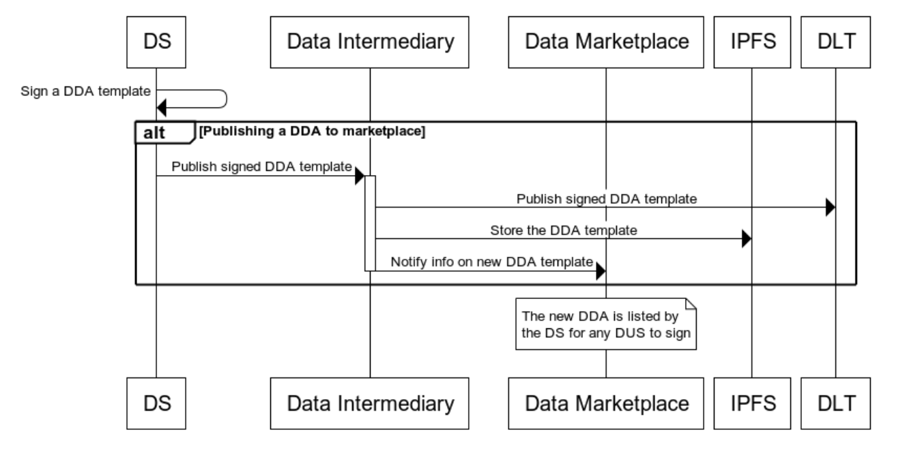

# Data Disclosure Agreement Protocol Specification

## Abstract
Data disclosure agreements focuses on enables automated agreement handling to enable data sharing and exchange between data sources and data using services. It helps organisations to continue leveraging data while being transparent and legitimate in their data usage in a scalable manner while adhering to data regulations. It also provides individuals control over how their data is used and exchanged.

## Status of This Document
Work in progress, version 0.9

## Authors
Mr. George Padayatti (iGrant.io, Sweden)  
Mr. Lal Chandran (iGrant.io, Sweden)

## Contributors and Reviwers
Dr. David Goodman (iGrant.io, Sweden)  
Mr. Jan Linquist (Linaltec, Sweden)  
Ms. Lotta Lundin (iGrant.io, Sweden)

### Actors

1. Data Using Service
2. Data Source
3. Individual
4. Data Intermediary
5. Data Marketplace

## Protocol flow

### Pre-requisite

All the actors involved in the protocol flow is a DIDComm agent. Each interaction between the actors require a DIDComm message. 

Prior to the PS-SDA protocol flow, actors must establish connection [1] between each other and identify themselves by presenting the necessary proofs [2]. 

All the actors will have a wallet address and an associated public / private key pair. 

A wallet address is an external owned account Ethereum address. Ethereum addresses are composed of the prefix "0x" (a common identifier for hexadecimal) concatenated with the rightmost 20 bytes of the Keccak-256 hash of the ECDSA public key with the curve secp256k1.

### Out of scope

Marketplace has performed KYC and onboarded DS and DUS.

### Data Source publish Data Disclosure Agreement to Marketplace




#### Messages

The `/dda-marketplace/1.0` protocol consists of these messages:

1. `/dda-marketplace/1.0/publish-request`
2. `/dda-marketplace/1.0/publish-response`


#### Sign the DDA template

Data Source (DS) prepares a DDA template and signs it using the secp256k1 private key. The signature is prepared by performing the proof algorithm described by W3C Data Integrity 1.0 specification [3].

#### Send DDA template to Data Intermediary 

Data Source (DS) constructs a `/dda-marketplace/1.0/publish-request` DIDComm message and send it to Data Intermediary DIDComm agent. An example is provided below.

```
{
  "@type": "https://didcomm.org/dda/1.0/publish-request",
  "@id": "999f6c2b-b0e5-4123-aab0-b5f7bfc780c4",
  "created_time": "1639288911",
  "@from": "<sender did>",
  "@to": "<receipient did>",
  "body": {
    "data_disclosure_agreement": {}
  }
}
```

#### Data Intermediary stores the signed DDA to CAS

Once the data disclosure agreement is received from Data Source, Data Intermediary stores the document to Content Addressable Storage for e.g. IPFS and obtains the Content Identifier (CID).

#### Data Intermediary anchors CID to Ethereum

The Content Identifier (CID) pointing to DDA document is anchored to the Ethereum by executing `publishDDACID` smart contract function. 

Data Intermediary constructs a  `/dda-marketplace/1.0/publish-response` DIDComm message and send it to Data Source. This message contains Ethereum transaction hash for the Data Source to verify the transaction. An example is provided below.

```
{
  "@type": "https://didcomm.org/dda/1.0/publish-response",
  "@id": "53f19e0b-5be2-480a-92bc-fcdeabf69ad3",
  "~thread": {
        "thid": "999f6c2b-b0e5-4123-aab0-b5f7bfc780c4"
    },
  "created_time": "1639288911",
  "@from": "<sender did>",
  "@to": "<receipient did>",
  "body": {
    "txn_hash": "0xeba2df809e7a612a0a0d444ccfa5c839624bdc00dd29e3340d46df3870f8a30e"
  }
}
```

#### Data Marketplace lists the DDA

Data marketplace will subscribe to the smart contract events specific to `publishDDACID` function and list the DDA in the marketplace.

### Exchange of Personal Data Between Data Source and Data Using Service

There are 2 modes of exchange:

1. Without identification of the Individual
2. With Identification of the Individual

#### Without identification the Individual

In this mode of personal data exchange, DS and DUS do not need individual identity proof before the data exchange e.g. in the case of a DUS using  anonymous or pseudonymous data sharing to offer personalised services. 


#### With identification of Individual

DS and DUS require individual identity proof before the data exchange. This is the case, for e.g. during a registration process, check-ins, covid-credential exchange e.t.c


## Security Considerations

## Privacy Considerations

## Implementation Considerations

## References

1. Aries RFC 0160 Connection protocol - https://github.com/hyperledger/aries-rfcs/tree/main/features/0160-connection-protocol
2. Aries RFC 0037 Present Proof protocol - https://github.com/hyperledger/aries-rfcs/tree/main/features/0037-present-proof
3. W3C Data Integrity 1.0 specification - https://w3c-ccg.github.io/data-integrity-spec

