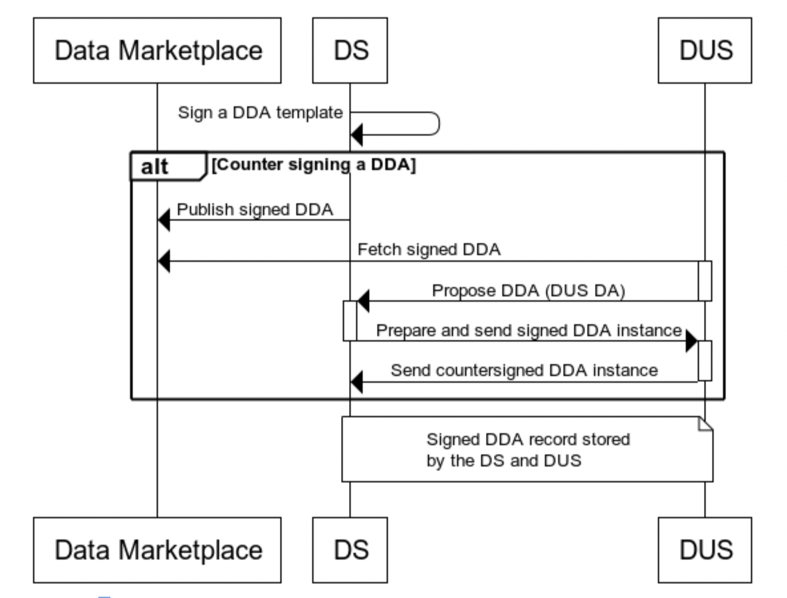

# Data Disclosure Agreement Protocol Specification

## Abstract
Data disclosure agreements focuses on enables automated agreement handling to enable data sharing and exchange between data sources and data using services. It helps organisations to continue leveraging data while being transparent and legitimate in their data usage in a scalable manner while adhering to data regulations. It also provides individuals control over how their data is used and exchanged.

## Status of This Document
Work in progress, version 0.9

## Authors
Mr. George J Padayatti (iGrant.io, Sweden)  
Mr. Lal Chandran (iGrant.io, Sweden)

## Contributors and Reviwers
Dr. David Goodman (iGrant.io, Sweden)  
Mr. Jan Linquist (Linaltec, Sweden)  
Ms. Lotta Lundin (iGrant.io, Sweden)

## Participate

~ [GitHub repo](https://github.com/decentralised-dataexchange/data-exchange-agreements)
~ [File a bug](https://github.com/decentralised-dataexchange/data-exchange-agreements/issues)
~ [Commit history](https://github.com/decentralised-dataexchange/data-exchange-agreements/commits/main)

## Protocol flow

### Actors

1. Data Using Service
2. Data Source
3. Individual
4. Data Intermediary
5. Data Marketplace

### Pre-requisite

All the actors involved in the protocol flow is a DIDComm agent. Each interaction between the actors require a DIDComm message. 

Prior to the PS-SDA protocol flow, actors must establish connection [1] between each other and identify themselves by presenting the necessary proofs [2]. 

All the actors will have a wallet address and an associated public / private key pair. 

A wallet address is an external owned account Ethereum address. Ethereum addresses are composed of the prefix "0x" (a common identifier for hexadecimal) concatenated with the rightmost 20 bytes of the Keccak-256 hash of the ECDSA public key with the curve secp256k1.

### Out of scope

Marketplace has performed KYC and onboarded DS and DUS.

### Data Source publish Data Disclosure Agreement to Marketplace


#### Messages

The `/dda-marketplace/1.0` protocol consists of these messages:

1. `/dda-marketplace/1.0/publish-request`
2. `/dda-marketplace/1.0/publish-response`


#### Sign the DDA template

Data Source (DS) prepares a DDA template and signs it using the secp256k1 private key. The signature is prepared by performing the proof algorithm described by W3C Data Integrity 1.0 specification [3].

#### Send DDA template to Data Intermediary 

Data Source (DS) constructs a `/dda-marketplace/1.0/publish-request` DIDComm message and send it to Data Intermediary DIDComm agent. An example is provided below.

```json
{
  "@type": "https://didcomm.org/dda/1.0/publish-request",
  "@id": "999f6c2b-b0e5-4123-aab0-b5f7bfc780c4",
  "created_time": "1639288911",
  "@from": "<sender did>",
  "@to": "<receipient did>",
  "body": {
    "data_disclosure_agreement": {}
  }
}
```

#### Data Intermediary stores the signed DDA to CAS

Once the data disclosure agreement is received from Data Source, Data Intermediary stores the document to Content Addressable Storage for e.g. IPFS and obtains the Content Identifier (CID).

#### Data Intermediary anchors CID to Ethereum

The Content Identifier (CID) pointing to DDA document is anchored to the Ethereum by executing `publishDDACID` smart contract function. 

Data Intermediary constructs a  `/dda-marketplace/1.0/publish-response` DIDComm message and send it to Data Source. This message contains Ethereum transaction hash for the Data Source to verify the transaction. An example is provided below.

```json
{
  "@type": "https://didcomm.org/dda/1.0/publish-response",
  "@id": "53f19e0b-5be2-480a-92bc-fcdeabf69ad3",
  "~thread": {
        "thid": "999f6c2b-b0e5-4123-aab0-b5f7bfc780c4"
    },
  "created_time": "1639288911",
  "@from": "<sender did>",
  "@to": "<receipient did>",
  "body": {
    "txn_hash": "0xeba2df809e7a612a0a0d444ccfa5c839624bdc00dd29e3340d46df3870f8a30e"
  }
}
```

#### Data Marketplace lists the DDA

Data marketplace will subscribe to the smart contract events specific to `publishDDACID` function and list the DDA in the marketplace.

### Negotiate Data Disclosure Agreement

DIDComm protocol for interaction between Data Source and Data Using Service to negotiate terms for Data Disclosure Agreement.




#### Messages

The `/dda-negotiation/1.0` protocol consists of these messages:

1. `/dda-negotiation/1.0/propose-terms`
2. `/dda-negotiation/1.0/accept-terms`
3. `/dda-negotiation/1.0/reject-terms`
4. `/dda-negotiation/1.0/accept-dda`

#### Data Using Service propose terms for DDA

Resolve CID to obtain DDA document from IPFS and then construct a counter proposal if the "terms" are not satisfactory. 

 An example is provided below.

```json
{
  "@type": "https://didcomm.org/dda-negotiation/1.0/propose-terms",
  "@id": "999f6c2b-b0e5-4123-aab0-b5f7bfc780c4",
  "created_time": "1639288911",
  "@from": "<sender did>",
  "@to": "<receipient did>",
  "body": {
    "data_disclosure_agreement": {}
  }
}
```

#### Data Source accepts the proposed terms

Data Source update the Data Disclosure Agreement to include the proposed terms and signs it. A copy of the same is send as response to Data Using Service.

An example is provided below.

```json
{
  "@type": "https://didcomm.org/dda-negotiation/dda-negotiation/1.0/accept-terms",
  "@id": "53f19e0b-5be2-480a-92bc-fcdeabf69ad3",
  "~thread": {
        "thid": "999f6c2b-b0e5-4123-aab0-b5f7bfc780c4"
    },
  "created_time": "1639288911",
  "@from": "<sender did>",
  "@to": "<receipient did>",
  "body": {
    "data_disclosure_agreement": {}
  }
}
```

#### Data Source rejects the proposed terms

An example is provided below.

```json
{
  "@type": "https://didcomm.org/dda-negotiation/dda-negotiation/1.0/reject-terms",
  "@id": "53f19e0b-5be2-480a-92bc-fcdeabf69ad3",
  "~thread": {
        "thid": "999f6c2b-b0e5-4123-aab0-b5f7bfc780c4"
    },
  "created_time": "1639288911",
  "@from": "<sender did>",
  "@to": "<receipient did>"
}
```

#### Data Using Service accepts the DDA

Data Using Service counter signs the accepted DDA and send a copy to Data Source.

An example is provided below.

```json
{
  "@type": "https://didcomm.org/dda-negotiation/dda-negotiation/1.0/accept-dda",
  "@id": "1b8381a8-5b7a-44b0-a6b6-037a4aac5609",
  "created_time": "1639288911",
  "@from": "<sender did>",
  "@to": "<receipient did>"
  "body": {
    "data_disclosure_agreement": {}
  }
}
```


### Exchange of Personal Data Between Data Source and Data Using Service

There are 2 modes of exchange:

1. Without identification of the Individual
2. With Identification of the Individual

#### Without identification the Individual

In this mode of personal data exchange, DS and DUS do not need individual identity proof before the data exchange e.g. in the case of a DUS using  anonymous or pseudonymous data sharing to offer personalised services, IQVIA Connected Intelligence connects with data and provide insights for decision making.


##### Data Agreement Negotiation

Data Source and Individual performs interaction in conformance to [ADA RFC 0003](https://github.com/decentralised-dataexchange/automated-data-agreements/blob/main/docs/didcomm-protocol-spec.md#40ada-rfc-0003-data-agreement-negotiation-protocol-10).

##### Release personal data

###### Messages

The `/data-exchange/1.0` protocol consists of these messages:

1. `/data-exchange/1.0/request-access`
2. `/data-exchange/1.0/grant-access`

###### Data Using Service request access to personal data

Data Using Service requests access to personal data by presenting hash of signed DDA document to Data Source.

An example is provided below.


```json
{
  "@type": "https://didcomm.org/dda-negotiation/data-exchange/1.0/request-access",
  "@id": "1b8381a8-5b7a-44b0-a6b6-037a4aac5609",
  "created_time": "1639288911",
  "@from": "<sender did>",
  "@to": "<receipient did>"
  "body": {
    "dda_hash": ""
    "nonce": ""
  }
}
```

###### Data Source grant access to personal data

Data Source validates (for e.g. check expiry, check revocation list) and authenticate the DDA and release an "access_token" to the protected resources. 

Access Token is constructed according to [JWT IETF 7519](https://datatracker.ietf.org/doc/html/rfc7519). Access Token claimset contain necessary claims for access to the protected resource. Following are mandatory claims.

- `dda`: Hash of the signed dda.
- `resource_endpoints`: Array of protected resource endpoints which accepts the Access Token.
- `iss` (issuer): Issuer of the JWT
- `sub` (subject): Subject of the JWT (the user)
- `aud` (audience): Recipient for which the JWT is intended
- `exp` (expiration time): Time after which the JWT expires
- `nbf` (not before time): Time before which the JWT must not be accepted for processing
- `iat` (issued at time): Time at which the JWT was issued; can be used to determine age of the JWT
- `jti` (JWT ID): Unique identifier; can be used to prevent the JWT from being replayed (allows a token to be used only once)

To ensure secure Access Token issuance, we implement an Authenticated Key Exchange (AKE) cryptographic protocol. AKE provides additional security against potential attacks (MITM, replay attacks, other).

AKE1 variant, as described in chapters 21.1-21.2 (https://toc.cryptobook.us/book.pdf) is implemented.

AKE is a non-interactive protocol. The steps are provided below.

1. Encrypt the Access Token using secp256k1 public key associated with Data Using Service to obtain the cipher text. (AES-CBC ECIES)
2. Generate signature for the cipher text.

Data Source publish the access token to Ethereum blockchain by executing the `publishAccessToken` smart contract function. This function accepts 3 params:

- `cipher_text`
- `sig`
- `nonce`

Data Source constructs `/data-exchange/1.0/grant-access` DIDComm message with Ethereum transaction hash in the body and respond to Data Using Service. 

An example is provided below.

```json
{
  "@type": "https://didcomm.org/dda-negotiation/data-exchange/1.0/grant-access",
  "@id": "999f6c2b-b0e5-4123-aab0-b5f7bfc780c4",
  "~thread": {
        "thid": "1b8381a8-5b7a-44b0-a6b6-037a4aac5609"
    },
  "created_time": "1639288911",
  "@from": "<sender did>",
  "@to": "<receipient did>"
  "body": {
    "txn_hash": "0xeba2df809e7a612a0a0d444ccfa5c839624bdc00dd29e3340d46df3870f8a30e"
  }
}
```

###### Data Using Service obtains the access token

Data Using Service resolves the transaction to obtains the cipher_text, sig and nonce. Proceeds to perform following steps.

1. Decrypts the cipher_text using private key. (AES-CBC ECIES)
2. Verifies the signature.
3. Decode the payload in Access Token JWT to obtains claims and identify the endpoints accessible for the access token.

> Note: Cipher text format - `<iv><raw ephemeral public key><encrypted data>`


#### With identification of Individual

DS and DUS require individual identity proof before the data exchange. This is the case, for e.g. during a registration process, check-ins, covid-credential exchange e.t.c


Individual in the above flow digram maintains 2 identity. They are:

1. Identity_DS - Identity of Individual at Data Source
2. Identity_DUS - Identity of Individual at Data Using Service

##### Data Agreement Negotiation between Data Source and Individual

Data Source and Individual performs interaction in conformance to [ADA RFC 0003](https://github.com/decentralised-dataexchange/automated-data-agreements/blob/main/docs/didcomm-protocol-spec.md#40ada-rfc-0003-data-agreement-negotiation-protocol-10).

##### Delegated Data Agreement Negotiation between Data Using Service and Individual


#### Messages

The `/delegated-da-negotiation/1.0` protocol consists of these messages:

1. `/delegated-da-negotiation/1.0/initiate`
2. `/delegated-da-negotiation/1.0/connection-invitation`
3. `/delegated-da-negotiation/1.0/offer`
4. `/delegated-da-negotiation/1.0/accept`
5. `/delegated-da-negotiation/1.0/reject`
6. `/delegated-da-negotiation/1.0/forward`

#### Data Using Service requests Data Source to collect sign off for Data Agreement (DUS) from Identity_DS

An example is provided below.

```json
{
  "@type": "https://didcomm.org/delegated-da-negotiation/1.0/initiate",
  "@id": "999f6c2b-b0e5-4123-aab0-b5f7bfc780c4",
  "created_time": "1639288911",
  "@from": "<sender did>",
  "@to": "<receipient did>",
  "body": {
    "da": {}
  }
}
```

#### Data Source responds with connection-invitation for individual

An example is provided below.

```json
{
  "@type": "https://didcomm.org/delegated-da-negotiation/1.0/initiate",
  "@id": "1b8381a8-5b7a-44b0-a6b6-037a4aac5609",
  "~thread": {
    "thid": "999f6c2b-b0e5-4123-aab0-b5f7bfc780c4"
  },
  "created_time": "1639288911",
  "@from": "<sender did>",
  "@to": "<receipient did>",
  "body": {
    "invitation": {
      "serviceEndpoint": "https://didcomm.data-source.com/",
      "routingKeys": [],
      "recipientKeys": [
        "kHJvUaokuKfz4sELM6qCSELiHxBNikjcMnvjo3Kjq8L"
      ],
      "@id": "cf4bbbab-a60a-472c-9d9f-66852b20f6cb",
      "@type": "did:sov:BzCbsNYhMrjHiqZDTUASHg;spec/connections/1.0/invitation"
    }
  }
}
```

#### Individual establishes connection with Data Source

Data Using Service presents the connection-invitation received from Data Source to Individual as QR code (or other means.). Individual establishes connection with Data Source. [1]

#### Data Source identifies Individual as Identity_DS

Data Sources identifies Individual by requesting proof presentation for Data Source issued Verifiable Credential [2] that issued when Individual onboarded to Data Source.

#### Data Source offers Data Agreement to Individual from Data Using Service

DS checks if a DA (purpose: 3rd party disclosure) exists between DS and Individual. If exists, Data Sources adds `offer_endorsed` event in to DA and signs the DA. The signed DA is offered to the Individual.

An example is provided below.

```json
{
  "@type": "delegated-da-negotiation/1.0/offer",
  "@id": "999f6c2b-b0e5-4123-aab0-b5f7bfc780c4",
  "created_time": "1639288911",
  "@from": "<sender did>",
  "@to": "<receipient did>",
  "body": {
    "da": {}
  }
}
```

#### Individual accepts the Data Agreement

Constructs the DIDComm message in accordance to [ADA RFC 0003](https://github.com/decentralised-dataexchange/automated-data-agreements/blob/main/docs/didcomm-protocol-spec.md#4222accept).

#### Individual rejects the Data Agreement

Constructs the DIDComm message in accordance to [ADA RFC 0003](https://github.com/decentralised-dataexchange/automated-data-agreements/blob/main/docs/didcomm-protocol-spec.md#4223reject).

> Individual should construct a forward message with Data Using Service as receipient and send it to Data Source. Data Source will forward the same to Data Using Service.


#### Data Source forwards the response from Individual to Data Using Service

Process the `/forward` message in accordance to [Aries RFC 0094](https://github.com/hyperledger/aries-rfcs/blob/main/concepts/0094-cross-domain-messaging/README.md)


##### Release personal data

###### Messages

The `/data-exchange/1.0` protocol consists of these messages:

1. `/data-exchange/1.0/request-access`
2. `/data-exchange/1.0/grant-access`

###### Data Using Service request access to personal data

Data Using Service requests access to personal data by presenting hash of signed DA document to Data Source.

An example is provided below.


```json
{
  "@type": "https://didcomm.org/dda-negotiation/data-exchange/1.0/request-access",
  "@id": "1b8381a8-5b7a-44b0-a6b6-037a4aac5609",
  "created_time": "1639288911",
  "@from": "<sender did>",
  "@to": "<receipient did>"
  "body": {
    "da_hash": ""
    "nonce": ""
  }
}
```

###### Data Source grant access to personal data

Data Source validates (for e.g. check expiry, check revocation list) and authenticate the DA and release an "access_token" to the protected resources. 

Access Token is constructed according to [JWT IETF 7519](https://datatracker.ietf.org/doc/html/rfc7519). Access Token claimset contain necessary claims for access to the protected resource. Following are mandatory claims.

- `dda`: Hash of the signed dda.
- `da`: Hash of the signed da
- `resource_endpoints`: Array of protected resource endpoints which accepts the Access Token.
- `iss` (issuer): Issuer of the JWT
- `sub` (subject): Subject of the JWT (the user)
- `aud` (audience): Recipient for which the JWT is intended
- `exp` (expiration time): Time after which the JWT expires
- `nbf` (not before time): Time before which the JWT must not be accepted for processing
- `iat` (issued at time): Time at which the JWT was issued; can be used to determine age of the JWT
- `jti` (JWT ID): Unique identifier; can be used to prevent the JWT from being replayed (allows a token to be used only once)

To ensure secure Access Token issuance, we implement an Authenticated Key Exchange (AKE) cryptographic protocol. AKE provides additional security against potential attacks (MITM, replay attacks, other).

AKE1 variant, as described in chapters 21.1-21.2 (https://toc.cryptobook.us/book.pdf) is implemented.

AKE is a non-interactive protocol. The steps are provided below.

1. Encrypt the Access Token using secp256k1 public key associated with Data Using Service to obtain the cipher text. (AES-CBC ECIES)
2. Generate signature for the cipher text.

Data Source publish the access token to Ethereum blockchain by executing the `publishAccessToken` smart contract function. This function accepts 3 params:

- `cipher_text`
- `sig`
- `nonce`

Data Source constructs `/data-exchange/1.0/grant-access` DIDComm message with Ethereum transaction hash in the body and respond to Data Using Service. 

An example is provided below.

```json
{
  "@type": "https://didcomm.org/dda-negotiation/data-exchange/1.0/grant-access",
  "@id": "999f6c2b-b0e5-4123-aab0-b5f7bfc780c4",
  "~thread": {
        "thid": "1b8381a8-5b7a-44b0-a6b6-037a4aac5609"
    },
  "created_time": "1639288911",
  "@from": "<sender did>",
  "@to": "<receipient did>"
  "body": {
    "txn_hash": "0xeba2df809e7a612a0a0d444ccfa5c839624bdc00dd29e3340d46df3870f8a30e"
  }
}
```

###### Data Using Service obtains the access token

Data Using Service resolves the transaction to obtains the cipher_text, sig and nonce. Proceeds to perform following steps.

1. Decrypts the cipher_text using private key. (AES-CBC ECIES)
2. Verifies the signature.
3. Decode the payload in Access Token JWT to obtains claims and identify the endpoints accessible for the access token.

> Note: Cipher text format - `<iv><raw ephemeral public key><encrypted data>`


### Smart Contracts

Following are the smart contracts that will be used in the protocol:

- [Ethereum DID Registry smart contract for did:ethr identifiers](https://github.com/uport-project/ethr-did-registry/blob/develop/contracts/EthereumDIDRegistry.sol)
- DDA Marketplace smart contract
  - `publishDDACID(CID)`
  - `publishAccessToken(cipher_text, sig, nonce)`


## Security Considerations

## Privacy Considerations

## Implementation Considerations

Successful execution of protocols described in this document, might involve invoking sub-protocols, a co-routine approach can simplify this, where it is possible to compose multiple protocol to achieve a complex goal. For e.g. During exchange of personal data with identification of Individual, it is necessary of Data Source to invoke "Connections" protocol and then "Verifications" protocol e.t.c, after which Data Source get's back to Data Using Service with positive or negative response. All this while Data Using Service, can check the status of protocol with Data Source. This approach is being discussed in detail at [Aries RFC 0478](https://github.com/hyperledger/aries-rfcs/tree/main/concepts/0478-coprotocols).

## References

1. Aries RFC 0160 Connection protocol - https://github.com/hyperledger/aries-rfcs/tree/main/features/0160-connection-protocol
2. Aries RFC 0037 Present Proof protocol - https://github.com/hyperledger/aries-rfcs/tree/main/features/0037-present-proof
3. W3C Data Integrity 1.0 specification - https://w3c-ccg.github.io/data-integrity-spec

